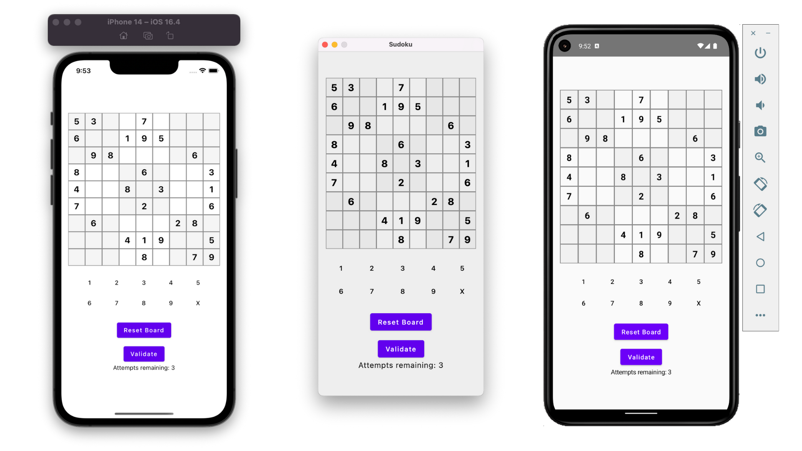

# Sudoku with Jetpack Compose Multiplatform

This project is based on the [Compose Multiplatform template](https://github.com/JetBrains/compose-multiplatform) by JetBrains.
Welcome to our Sudoku game, built using Jetpack Compose Multiplatform. This project showcases the game dynamics and the capabilities of Jetpack Compose in a multiplatform environment. A significant portion of this codebase was generated interactively with ChatGPT by OpenAI, demonstrating the synergy between AI and modern software development.

## Prerequisites

- A machine running a recent version of macOS (for iOS development)
- [Xcode](https://apps.apple.com/us/app/xcode/id497799835) (for iOS development)
- [Android Studio](https://developer.android.com/studio)
- [Kotlin Multiplatform Mobile plugin](https://plugins.jetbrains.com/plugin/14936-kotlin-multiplatform-mobile) for Android Studio
- [CocoaPods dependency manager](https://kotlinlang.org/docs/native-cocoapods.html) (for iOS development)

> **Note**: You need a Mac with macOS to write and run iOS-specific code on simulated or real devices due to Apple requirements.

## Project Structure

- **`shared`**: Contains the logic common for desktop, Android, and iOS applications. This is where the Compose Multiplatform code resides.
- **`desktopApp`**: Builds into a desktop application.
- **`androidApp`**: Builds into an Android application.
- **`iosApp`**: An Xcode project that builds into an iOS application.

## Running the Application

### Desktop

1. In Android Studio, select `desktopApp` from the list of run configurations.
2. Click **Run**.

### Android

1. Ensure you have an Android virtual device available or connect a physical device.
2. In Android Studio, select `androidApp` from the list of run configurations.
3. Click **Run**.

### iOS

1. In Android Studio, select `iosApp` from the list of run configurations.
2. Choose your target device (simulator or physical device) and click **Run**.

## Contributing

Feel free to explore the project further, raise issues, or submit pull requests. Your contributions are welcome!

## License

This project is licensed under the Apache 2.0 License - see the [LICENSE](LICENSE) file for details.
This README provides